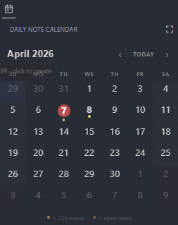
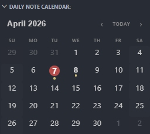

# Daily Note Calendar for VS Code

A calendar sidebar for creating and navigating daily notes — inspired by the [Obsidian Calendar Plugin](https://github.com/liamcain/obsidian-calendar-plugin).

 


## Features

- **Calendar sidebar** in the activity bar with month navigation
- **Click any day** to open or create a daily note
- **Word count dots** — each dot = 250 words (configurable), hollow dot = open tasks
- **Today highlight** — circled in your theme's accent color
- **Ctrl/Cmd+Click** to open a note in a split editor
- **Arrow key navigation** within the grid
- **Week numbers** (optional column)
- **Template support** with `{{title}}`, `{{date}}`, `{{time}}` placeholders
- **Auto-refresh** when files change
- Fully themed to your VS Code color scheme

## Quick Start

1. Open a workspace folder
2. Click the calendar icon in the activity bar
3. Click any day to create/open a daily note

Notes go to `daily-notes/` by default. Change this in settings.

## Keyboard Shortcut

`Ctrl+Alt+D` / `Cmd+Alt+D` — Open today's note

## Commands

| Command | Description |
|---|---|
| `Calendar: Open Today's Daily Note` | Open or create today's note |
| `Calendar: Reveal Active Note on Calendar` | Jump to the active note's date in the calendar |

## Settings

| Setting | Default | Description |
|---|---|---|
| `dateFormat` | `YYYY-MM-DD` | Filename date format |
| `notesFolder` | `daily-notes` | Notes folder (relative to workspace) |
| `noteExtension` | `.md` | File extension (`.md`, `.txt`, `.org`) |
| `templatePath` | *(empty)* | Template file path |
| `startWeekOn` | `monday` | First day of week (`monday` or `sunday`) |
| `wordsPerDot` | `250` | Words per dot (0 to disable) |
| `showWeekNumbers` | `false` | Show week number column |
| `confirmBeforeCreate` | `true` | Confirm before creating a new note |
| `colorMonth` | *(empty)* | Color for the month name in the header (e.g. `#569cd6`) |
| `colorYear` | *(empty)* | Color for the year number in the header |
| `colorWeekNumber` | *(empty)* | Color for the week numbers column |
| `colorDate` | *(empty)* | Color for the day numbers in the grid |
| `fontFamily` | *(empty)* | Font family for the calendar (e.g. `Georgia`) |

## Building from Source

```bash
npm install
npm run compile
# Press F5 in VS Code to launch
```

## License

MIT
